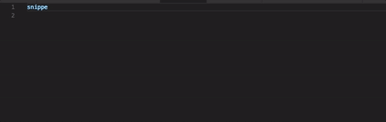
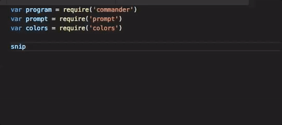
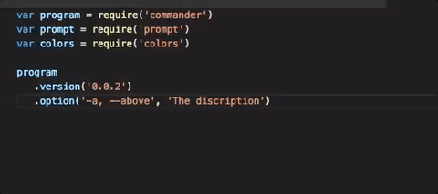

# commander_snippets
This is for the VSCode to easily make use of commander.js easy.

# Overview
In order to use commander.js you create a "program" that excepts commandline args and functions.

## Religion

I don't like to use ; and I like to use 3 spaces for indent.

# Installation
1. Visit [VSCode Market: Custom Snippets][marketplace-url].<br><br>**OR**

2. By VSCode
   * Open VSCode
   * Launch VS Code Quick Open (press **Ctrl+P**) 
   * Paste the following command

     ```
     ext install vscode-javascript-commander-snippet
     ```
   * Press **Enter** to search the extension
   * Select **JavaScript Commander Snippet** 
   * Click **Install**

## Usage

Type snippet prefix, and IntelliSense will show the snippet. If IntelliSense doesn't show the snippet, press **Ctrl+Space** and then **Enter** to insert the snippet.

# The Snippets

So, I like it when I can do things fast :) ... So, if you use the snippets, and you need to change stuff use the TAB and not the enter cause it will move so you will fill in each of the items you need. Try it.

## snippetCommanderRequirer
This snippet will create the three require for:
*  commander
*  prompt
*  colors

```
var program = require('commander')
var prompt = require('prompt')
var colors = require('colors')
```

Number of Tabstops: 0



Why these? Well in almost all cases I use commander.js to create commandline tools, as such, I like to use prompt to get info, from the user if they haven't given me the expected valid input ... so I almost always use it. Also, it is easy to delete prompt and colors :)

## snippetCommanderVersion
This creates the version and options for the command you are making.

```
program
   .version('0.0.1')
   .option('-i, --info', 'description')
```

Number of Tabstops: 4



## snippetCommanderAction
This will create the commander.js action
```
program
  .command("command named_value")
  .description('description')
  .action(function(named_value, options) {
     console.log(colors.red,"message")
})
```

Number of Tabstops: 3

## snippetCommanderError
This will create the custom error function for your command.
```
program.on('error', function(err, command){
    console.log('')
    console.log(colors.red('  Error:', err.message))
    command.outputUsage()
    command.outputCommands()
    command.outputOptions()
    console.log()
    process.exit(1)
})
```
I gave this one as a simple example one cause I hate trying to remember all the Usage, Commands, and Options values. Again, as before I just delete it when I don't want it.

Number of Tabstops: 0

## snippetCommanderHelp
This will create the custom help function for your command.
```
program.on('--help', function(){

})
```

Number of Tabstops: 0

## snippetCommanderOption
This will create just the one option value for your command.
```
.option('-i, --info', 'description')
```

Number of Tabstops: 3


